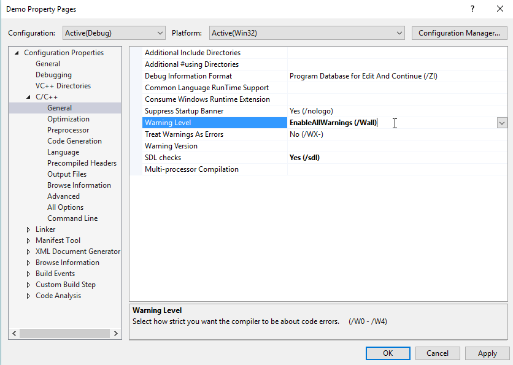
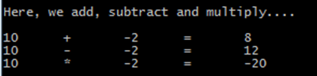

Exercise 2.1 Program Structure
==============================

**Read this first:** When doing the exercises, it is advised that you make notes! These notes will be useful for the assignment you have to write later on in the course.

In this repository, you will find the files you need to build a very simple, and for the purpose of arithmetic operations somewhat superfluous file structure. But they go to explain the concept of how to divide a C program into logical file structures.

Have a look at all the files and specially the main.c file:

```c
#include <stdio.h>

#include "subtraction.h"
#include "multiplication.h"

int main (void) {
  int a = 10;
  int b = -2;

  printf ("\nHere, we add, subtract and multiply....\n\n");
  printf ("%d\t+\t%d\t=\t%d\n", a, b, cal_add(a,b));
  printf ("%d\t-\t%d\t=\t%d\n", a, b, cal_subtract(a,b));
  printf ("%d\t*\t%d\t=\t%d\n", a, b, cal_multiply(a,b));

  return 0;
}

```

Fist setup your compilers Warning level to `/Wall`. Right click on your project in the solution explorer, go to options, and change the warning level as shown here:



1. Compile the program structure, and explain the errors you get.

1. In the files, various declarations, definitions and includes are missing – fix the errors that you can find until you can compile the entire program and when running it get the following output:
